# Semantic Bottleneck X-ICM Flowchart

This is a proposal diagram only. It does not change the current X-ICM baseline,
v1, v2, or v3 evaluation code.

```mermaid
flowchart LR
    %% Paper-style two-stream layout: seen demos on top, unseen query below.

    subgraph Seen["Seen Demonstrations D_i"]
        direction TB
        S0["18 seen training tasks"]
        S1["Seen demo episodes"]
        S2["Per-key-action trajectory<br/>obs_i,t -> 7D action_i,t"]
        S3["Geometry g_i<br/>Affordance a_i<br/>Scene summary s_i"]
        S4["Cached seen demo bank<br/>3,600 demos"]
        S0 --> S1 --> S2 --> S4
        S1 --> S3 --> S4
    end

    subgraph Query["Unseen Query Q_j"]
        direction TB
        Q0["Unseen task instruction"]
        Q1["Initial/current observation only"]
        Q2["Geometry g_j<br/>Affordance a_j<br/>Scene summary s_j"]
        Q3["No future observations<br/>No ground-truth actions<br/>No unseen demos"]
        Q0 --> Q2
        Q1 --> Q2
        Q1 --> Q3
    end

    subgraph Retrieval["Retrieve Seen Context"]
        direction TB
        R0["Original X-ICM dynamics score<br/>S_dyn(D_i, Q_j)"]
        R1["Semantic compatibility score<br/>match g_i/a_i/s_i with g_j/a_j/s_j"]
        R2["Rerank and select top-k seen demos"]
        R3["Top-k context:<br/>instruction + trajectory + g_i/a_i/s_i"]
        R0 --> R2
        R1 --> R2 --> R3
    end

    subgraph Stage1["Stage 1 LLM: Scene-To-Intent"]
        direction TB
        I0["Input:<br/>unseen instruction + obs_j + g_j/a_j/s_j<br/>top-k seen summaries"]
        I1["Predict clean semantic plan"]
        I2["target object<br/>reference object<br/>action primitive<br/>contact point<br/>motion direction<br/>orientation constraint<br/>goal relation"]
        I0 --> I1 --> I2
    end

    subgraph Stage2["Stage 2 LLM: Intent-To-Action"]
        direction TB
        A0["Input:<br/>semantic plan + top-k seen trajectories<br/>unseen obs_j + g_j/a_j/s_j"]
        A1["Adapt one or few compatible demo rhythms"]
        A2["Predict key 7D action sequence"]
        A0 --> A1 --> A2
    end

    subgraph Robot["Robot Evaluation"]
        direction TB
        E0["Execute predicted key actions"]
        E1["Task rollout score"]
        E0 --> E1
    end

    S4 --> R0
    S4 --> R1
    Q2 --> R0
    Q2 --> R1
    Q2 --> I0
    R3 --> I0
    I2 --> A0
    R3 --> A0
    Q2 --> A0
    A2 --> E0

    classDef seen fill:#eef6ff,stroke:#4b83c2,stroke-width:1.5px,color:#10233f;
    classDef query fill:#fff6e8,stroke:#c07a24,stroke-width:1.5px,color:#3d2505;
    classDef retrieve fill:#f1f8ee,stroke:#5b9b50,stroke-width:1.5px,color:#15330f;
    classDef llm fill:#f7efff,stroke:#7b56b8,stroke-width:1.5px,color:#291547;
    classDef robot fill:#f3f3f3,stroke:#777,stroke-width:1.5px,color:#222;

    class S0,S1,S2,S3,S4 seen;
    class Q0,Q1,Q2,Q3 query;
    class R0,R1,R2,R3 retrieve;
    class I0,I1,I2,A0,A1,A2 llm;
    class E0,E1 robot;
```

## Short Reading

The core change is the middle purple block. Instead of asking the LLM to jump
directly from retrieved demos to noisy 7D action numbers, Stage 1 predicts a
simple manipulation intent in words. Stage 2 then converts that cleaner intent
into 7D key actions using the retrieved seen trajectories as numeric examples.

The unseen side stays paper-faithful: it contributes only the instruction,
current observation, and derived geometry/affordance/scene descriptions.
